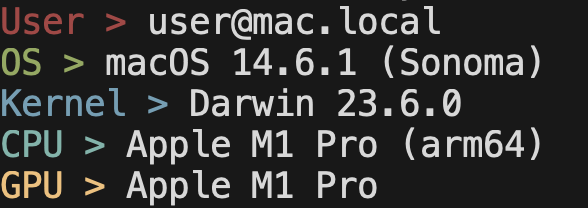
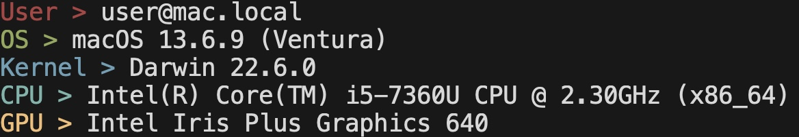
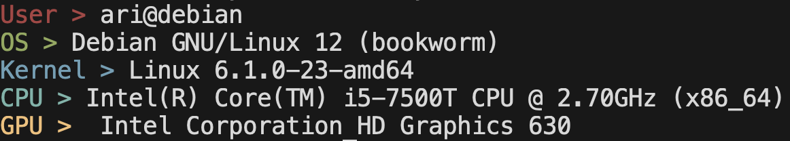

<h3 align="center"></h3>

<p align="center">A tiny command line system information tool written in C.</p>
  
<p align="center">
<a href="./LICENSE"></a>
</p>

Tinyfetch is a tiny command line system information tool written in C. It can show you information about the current user, hostname, operating system, and software in a small but quick package.

### Previews

#### Mac Sonoma (M1)


#### Mac Ventura (Intel)


#### Debian Bookworm (Intel)


### Getting Started

First download the code onto your computer. Right now tinyfetch will only compile on macOS (arm or x86) and linux machines.

Run make.
```
make
```
Now you will have the executable, run it.
```
./tinyfetch
```
You should get an output similar to one of the three above.
